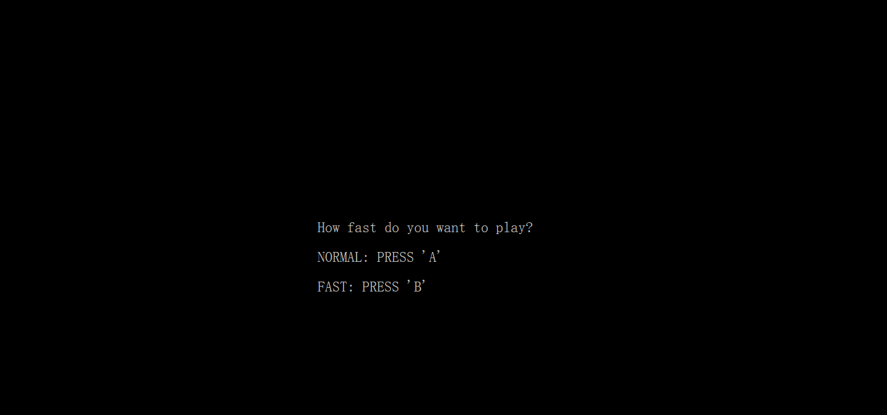

# console-snake
<h1>A console snake game for C++ beginner<h1>

I learned to code the game from [this video](https://www.youtube.com/channel/UC-yuWVUplUJZvieEligKBkA) by @javidx9 and I have added two things:
- Allow the user to choose snake speed at the beginning of each game loop
- Optimize the key press function GetAsyncKeyState() using the [Virtual-Key Codes](https://docs.microsoft.com/en-us/windows/win32/inputdev/virtual-key-codes).
  
